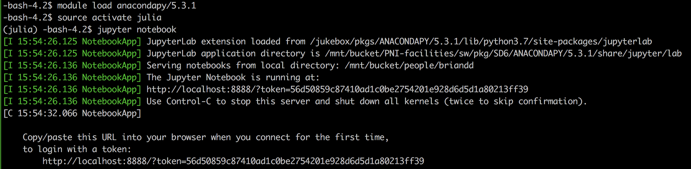

# pulse input DDM

This is a package for inferring the parameters of drift diffusion models (DDMs) using gradient descent from spiking neural activity or choice data collected when a subject is performing a pulsed input evidence accumlation task.

## Getting Started

If you want to fit the model to some data, but want to interact with Julia, I recommend using a Jupyter notebook and scotty. This is somewhat involved to set up, but worth the time. Here are the steps necessary to do this.

### Fitting the model interactively on scotty

First you need to install Julia in your local scotty user directory via anaconda. This will be a whole new installation of Julia (not the installation you might normally use on scotty if you typed `module load julia`) which means if you've used another installation of Julia on scotty before, all of the packages you might have added won't be there. The reason for using a new anaconda installation of Julia is that 

#### Installing Julia via anaconda

From your local machine, make a ssh connection with scotty, 

```
    >> ssh [username]@scotty.princeton.edu
```

where `[username]` is your scotty username, assuming you have one. If you do not have a username email <pnihelp@princeton.edu>.

(If you haven't configured your local machine so that you can avoid using the VPN to access scotty, first do that. Instructions for doing so are provided on the [Efficient Remote SSH](@ref) page.)

Next load an anaconda module (for example, 5.1.0), 

```
    >> module load anacondapy/5.1.0
``` 

Presently, you are using the "base" anaconda environment, for which PNI users do not have write privileges. You need to create a new environment, which we will call "Julia",

```
    >> conda create --name julia
``` 

Now that you've created this new environment, you need to use it, 

```
    >> source activate julia
``` 

Next, you need to install Julia via [anaconda](https://anaconda.org/conda-forge/julia), 

```
    >> conda install -c conda-forge julia
```

You are using a *whole new version of Julia* (not the same one as when you execute `module load julia` on scotty or spock), so you will need to re-install lots of packages (if you have used Julia on scotty or spock before), most specifically, the IJulia package.

#### Installing the IJulia package

Once, Julia is installed, you can launch it by typing `>> julia`. From here, you need to add the IJulia package so you can use Julia in a notebook. This is done in the normal way,

```
    julia > using Pkg
    julia > Pkg.add("IJulia")
```

You might now want to add any packages you use, again in the normal way (for example, you can now add the pulse_input_DDM package, as we will do eventually, described in the [Getting the pulse input DDM package from GitHub](@ref) section). You're done (with this part)! You can exit Julia.

#### Opening a notebook on scotty and creating a SSH tunnel

Now, that Julia is all set up, you need to launch a Jupyter notebook on scotty (which is possible because you're already using the anaconda module, which contains jupyter). In your ssh connection to scotty, type 

```
    >> jupyter notebook
``` 

Once this has executed, it will pick a port on which to run and provide you a url so that you can launch the notebook in your local browser. But before you can do that, you need to create a "ssh tunnel" from the open port on scotty and a port on your local machine. *In a separate terminal window*, create a *new* ssh connection to scotty, but one that will map the ports, 

```
    >> ssh -L <port>:localhost:<port> [username]@scotty.princeton.edu
``` 

where `<port>` is the port assigned by scotty, and the second `<port>` is one on your local machine (you can pick the same one that scotty did, if you don't happen to be already using it).

Now, copy the url that was created when you launched the jupyter notebook into your local browser, and voila! On a mac, you can press the "command" key (⌘), and the url should become underlined, at which point you can click on it with the  mouse and the link should open in your local browser.

Here is a screen shot of what a typical terminal will look like, showing the url that needs to be copied and pasted:



#### Now that everything's set up, how do I open a notebook again?

Next time, you only need to:

- SSH into scotty: `>> ssh scotty`.
- Load the anaconda module: `>> module load anacondapy/5.1.0`.
- Activate the julia environment: `>> source activate julia`.
- Launch a jupyter notebook: `>> jupyter notebook`.
- Create the ssh tunnel: `>> ssh -L <port>:localhost:<port> scotty`.

These instructions can also be found [here](https://brodylabwiki.princeton.edu/wiki/index.php/Internal:IJulia_notebook_on_scotty).

###  Getting the pulse input DDM package from GitHub

Now, you need to add the pulse_input_DDM package from the github repository. Startup up a "anaconda julia" REPL the same way we did above when you installed the IJulia pacakge, then  by typing the following commands into a Julia REPL:

```
    julia > using Pkg
    
    julia > Pkg.add(PackageSpec(url="https://github.com/PrincetonUniversity/pulse_input_DDM/"))
```

You will be prompted for your github username and password. This will require that you are part of the Princeton University github organization and the Brody Lab team. If you are not, fill out [this form](https://forms.rc.princeton.edu/github) to get added and make sure your mention that you want to be added to the Brody Lab team.

### Basics

```@contents
Pages = [
    "man/using_spock.md",
    "man/aggregating_sessions.md",
    "man/choice_observation_model.md",
    "man/neural_observation_model.md"]
Depth = 2
```

### To do

- RBF optimization and compare
- Instructions to modify docs
- Instructions to modify package (forking, branching, git related things)
- Instructions for formatting data
- Instructions for running optimizations and looking at results
- Instructions for running on spock.
- Shell scripts for running on spock.
