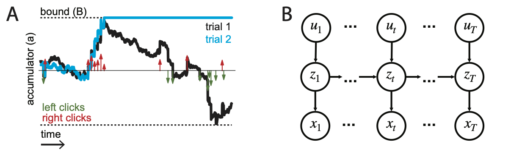

# Summary

Drift diffusion models (DDMs) are a popular model class for modeling a unobserved process that determines an subject's choice during a decision-making task [@Bogacz2006]. 

```math
 dz = \lambda zdt + u(t)dt + \sigma dW
```

[@Brunton2013]. 

# Statement of need

The initial motivation for writing ``PulseInputDDM.jl`` was to analyze experimental data collected from rats performing pulse-based evidence accumulation tasks. These findings were published in [@DePasquale2024]. 



`PyDDM` [@PyDDM2020]

# Package design

# Example

# Availability

# Conclusion

``PulseInputDDM.jl`` is publicly available under the [MIT license](https://github.com/Brody-Lab/PulseInputDDM.jl/blob/master/LICENSE) at <https://github.com/Brody-Lab/PulseInputDDM.jl>.

# Author contributions

BD did XXX. BB did XXX.

# Acknowledgements

This work was supported by the Princeton Neuroscience Institute and the Simons Foundation.

# References
